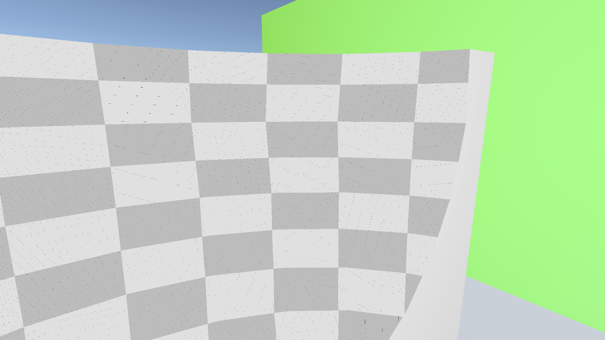

# Unity中通过光栅化绘制集合的差集

要说绘制形状的差集(也就是补集)或是交集，最容易想到的方法就是用SDF+Ray Marching。但是这种方法明显不适用于一般的网格(而且开销也相对大)。我们还是期望能用光栅化的方式来得到网格的差集或是交集(项目里我们就实现了差集的绘制，交集的只需在此基础上修改一下即可)。

[[1]hecomi/UnityScreenSpaceBoolean](https://github.com/hecomi/UnityScreenSpaceBoolean)里介绍了一种利用stencil buffer来实现差集的绘制的方法，不过这种方法有以下一些明显的缺点：

- 是$O(n^2)$的，
- 如果相机在作为减集的网格内部，“裁剪”效果会失效

因此并不适用于实际的项目(而且我个人也不太喜欢用stencil buffer)。我们的方法是$O(n)$的，不过如果想要有正确的绘制结果也是需要满足一定的条件的。

以下是绘制结果

# 1. 实现原理

设$A,B$是任意的两个集合，我们称
$$
A\setminus B:=\{x|x\in A\land x\notin B\}
$$
为$B$在$A$种的相对差集(补集)，有时也写作$A-B$。为了方便，我们在下文中称$A$为被减集，$B$为减集。

> [!NOTE]
>
> 注意，~~尽管任意指定的光栅化过程在一定条件下可以被视为是函数，但将其视为函数来思考又好像不太可能(这样的函数之间没有简单的关系)~~。因此我们需要通过实现一个简单例子的绘制，然后将其尽可能的一般化。

下面我们考虑如何以一个球体为减集，一个立方体为被减集，来得到下图右侧的效果

我们只需绘制出如下图所示的$S_0$与$S_1$，再基于mask的值混合即可得到所求的区域

我们记$B_i$是立方体的内表面的光栅化结果(mask+深度，这里我们说的深度是0为近裁剪面1为远裁剪面的，与项目里dx的深度是相反的)，$B_o$是立方体的外表面光栅化结果，$S_i,\,S_o$分别是球面的内外表面的光栅化结果。那么
$$
S_0=B_i\setminus\{x\in S_i|d(S_i,x)>d(B_o,x)\},
$$
其中$x\in S_i$表示点在球的内表面光栅化的区域内(也即在点$x$处采样$S_i$的mask的值不是默认值)，$d(S_i,x)$表示在点$x$采样$S_i$的深度值，以及
$$
S_1=B_o\setminus S_o.
$$

> [!NOTE]
>
> 其实从这里我们就应该察觉到用光栅化来做集合差集，是对减集与被减集有一定的要求的：
>
> - 减集(与被减集)的表面需要是连通的闭曲面(其实可以更严格点，是道路连通的)
> - 任意与其表面相交的直线至多有两个交点
>
> 当然，并不是说不满足以上要求的减集与被减集就一定会导致结果出错，只是我们所用的减集与被减集需要尽可能的满足以上要求。

实际项目中肯定不会只有一个减集与被减集，那么我们就需要考虑裁剪区域与其前景或后景的遮挡关系了。我们思路是先绘制

- 被减集内表面的ZTest为LEqual的深度图
- 被减集内表面的ZTest为GEqual的深度图
- 被减集外表面的ZTest为LEqual的深度图
- 被减集外表面的ZTest为GEqual的mask与深度图

然后利用上述深度图，先处理减集的内表面的mask与深度(比前面的简单示例多了一些条件，详细见项目)，再利用减集的外表面处理mask，最后用一个Pass整合一下深度图(有需要的话也可以整合一下mask)。不够仅依靠这样的方法是一定会存在遮挡关系的错误剔除的，我们需要先对减集与被减集进行处理。

首先我们对减集基于其深度由远及近排序(CPU中做，当然也可以GPU做然后异步回读)，然后利用减集的包围盒计算与其相交的被减集(的包围盒)，仅对包围盒相交的被减集执行前面的剔除步骤，最后将结果(剔除完的深度图)pingpong混合即可。当然，这里我们要求同一个被减集只能与一个减集相交，否则结果一定是会存在错误的。

最后我们利用深度图，令ZTest为Equal来绘制使用过(被绘制过的)的被减集的外表面与减集的内表面，然后再绘制未使用过的被减集。

> [!NOTE]
>
> 项目里我们在绘制被减集与减集的深度时用的是`D16_UNorm`格式的纹理，因此实现这个功能所需的显存并没有太大。

# 2. 当前存在的问题

除了在前文提到过的要求与规则外，如果放大仔细看前面那些效果图会发现减集裁剪后渲染的区域(减集的内表面)多多少少有些黑点存在

要解决这个问题，有以下这些方案：

- 最简单的规避方法是将mask保留下来，利用mask绘制Screen Space的效果。
- 在绘制完全部的减集的内表面后，多一个额外的pass(当然，实际需要两步)，利用color buffer的alpha通道(这些黑点是未被渲染的点，因此其alpha通道的值为0——我们清空color buffer时设的alpha通道的值)，我们对黑点做个Holes Patching(采样邻近有效点)。
- 减集都是简单的几何体时：球、长方体、锥体、圆柱体等等，那么可以修改一下减集的深度绘制逻辑，我们绘制这类减集的包围盒构成的长方体的内表面，并利用相应的射线-形状检测函数来得到命中点，从而得到深度，之后也通过这种方式来绘制颜色(需要注意的是，这时候在比较深度的时候需要允许有一定的误差)。
- 绘制内表面的深度时，记录内表面的material id为其mask的值并同时绘制其uv、normal等deferred shading需要的纹理，之后通过material id作为depth buffer来绘制，以规避计算深度。

> [!NOTE]
>
> 当然，这个问题最有意思的地方应该是其产生的原因。是因为我们用的深度图的精度不够造成的吗？改成32bit的深度图后，会发现内表面的稀疏黑点变成了更大片的黑色区域了。而且实际上不论深度图的精度如何，外表面的绘制并没有问题。

# References

[[1]GitHub - hecomi/UnityScreenSpaceBoolean: Screen Space Boolean Implementation for Unity.](https://github.com/hecomi/UnityScreenSpaceBoolean)

[[2]geometrictools.com/GTE/Mathematics/IntrOrientedBox3OrientedBox3.h](https://www.geometrictools.com/GTE/Mathematics/IntrOrientedBox3OrientedBox3.h)